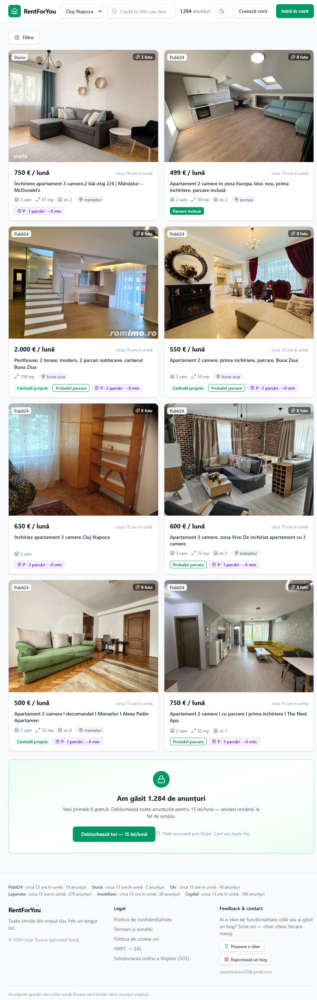
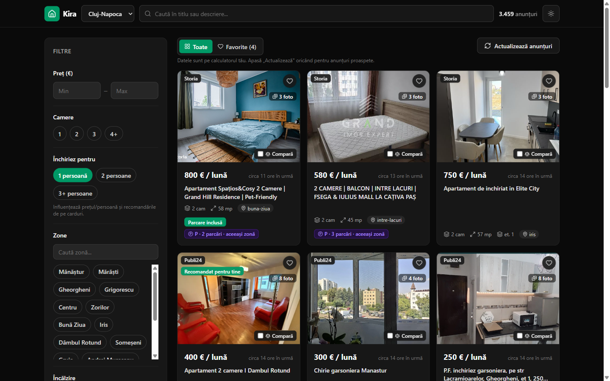

<div align="right"><a href="README.ro.md">🇷🇴 Română</a></div>

# Kira — a local rental-search aggregator for Romania

**Kira** pulls rental listings from many Romanian real-estate sites (Storia, OLX,
Imobiliare, Publi24, Lajumate and others) into one place, with filters the source
sites don't offer:

- **own gas boiler vs. district heating** — classified automatically from the ad's text
- **parking included** vs. a **rentable parking spot nearby** (with walking distance)
- **walking distance from your own address** (e.g. your university) to each listing + a Google Maps link

It runs **100% locally — free, no account, no payment.** Your data stays on your
machine and every card links back to the original ad on the source site.

> 🐶 **Why "Kira"?** It's my dog's name — my companion in frustration during the months
> I spent hunting for a rental with six browser tabs open at once. This tool fixes the
> exact headache we went through together, so it carries her name.

<p align="center">
  
  
</p>

> 🇷🇴 Romanian student? There's a step-by-step **[ghid în română →](README.ro.md)** for
> running it locally, written for non-technical users.

---

## What it does

- search + filters (price, rooms, neighbourhood, heating, parking, source)
- sorting, including **by distance** to an address you enter
- **favorites** + side-by-side **comparison** (stored locally in your browser)
- "best pick from your favorites" — scored on price, distance, parking and heating
- light / dark mode
- an in-app **"Refresh listings"** button that runs a fresh scrape on demand

## How it works

A polite scraping worker downloads public listing pages → a regex pipeline extracts
the facts from messy Romanian text (heating, parking, price, rooms, street) →
everything is geocoded and matched against nearby rentable parking spots → a FastAPI
backend serves it and a React SPA displays it. No listings ship in the repo: each user
generates their own data locally on first run (~10–12 minutes per city — it fetches
every listing from all sources politely, with progress shown live), then it's instant.

```
backend/   Python 3.12 · FastAPI · SQLAlchemy 2.0 (typed) · APScheduler · SQLite · pytest
frontend/  React 18 · TypeScript (strict) · Tailwind v4 · TanStack Query · React Router
```

**Engineering highlights:** 6 source adapters behind one `SiteScraper` contract
(JSON-embedded + HTML); pure-regex Romanian extractors (heating, parking taxonomy,
price-separator disambiguation, street, landmarks); a geocoding ladder
(street → landmark → zone → city) with a budgeted, DB-cached Nominatim client;
parking↔rent proximity matching with walking-time estimates; per-IP rate limiting and
an SSRF-safe image proxy; GDPR data minimisation (phone/email stripped from stored
text). ~70 backend tests, `ruff` + `tsc --strict` + ESLint clean.

## Run it locally

You need **Python 3.12+**, **Node.js 20+** and **Git**. A full step-by-step guide for
non-technical users (with download links and screenshots of every step) is in the
**[Romanian README](README.ro.md)**. The short version:

```bash
git clone https://github.com/Cezart3/KiraImobiliare.git
cd KiraImobiliare

# backend (terminal 1)
cd backend
python -m venv .venv
.venv\Scripts\python.exe -m pip install -e .          # macOS/Linux: .venv/bin/pip install -e .
.venv\Scripts\python.exe -m uvicorn app.main:app --port 8000

# frontend (terminal 2)
cd frontend
npm install
npm run dev
```

Open **http://localhost:5173**, pick a city, click **"Actualizează anunțuri"** (Refresh
listings). The first refresh takes ~10–12 minutes (it pulls every current listing from
all sources — you'll see live progress); afterwards it's instant.

### For developers
```bash
cd backend
.venv\Scripts\python.exe -m pip install -e ".[dev]"   # adds pytest, ruff
.venv\Scripts\python.exe -m pytest -q                 # ~70 tests
.venv\Scripts\ruff.exe check app
```

## Roadmap

If the project gains traction: **for-sale property listings** (not just rentals) and
more cities. **Ideas or a bug?** Open an issue or email cezartocaciu233@gmail.com —
I read every message. A ⭐ helps.

## Legal note

Personal/educational project, for **local, personal use**. Scraping is polite (delays,
page caps, on-disk cache); data stays at the source — every card links back to the
original ad. **If you run the app, you are responsible for complying with each source
site's Terms of Service.** No contact details are stored from ads, and **this repo
contains no listings** — each user generates their own data locally on first run.

## License

**Personal-Use, source-available license** (see [LICENSE](LICENSE)). In short:

- ✅ **You may** (encouraged!): clone it, run/modify it **locally, for yourself**, free,
  and tell your friends to do the same.
- ❌ **You may not**: redistribute/republish it on another repo, host it publicly,
  offer it as a service, or make money from it.

**Why public hosting/monetization isn't allowed:** the app aggregates listings from
third-party sites (OLX, Storia, etc.) whose Terms of Service forbid extracting,
aggregating and commercially reusing their data. Local, personal use (each person for
themselves) is private use and far more defensible; running a public service or making
money from their data would breach those terms and database-rights law. Hence:
**local use = fine; public/commercial = no.** Copyright in the code remains with the
author. © 2026 Cezar Tocaciu — all rights reserved.

---

<sub>Author: Cezar Tocaciu · [LinkedIn](https://www.linkedin.com/in/tocaciu-cezar-0865373b6/)</sub>
