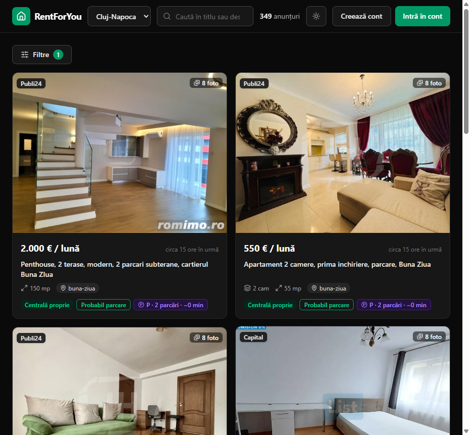
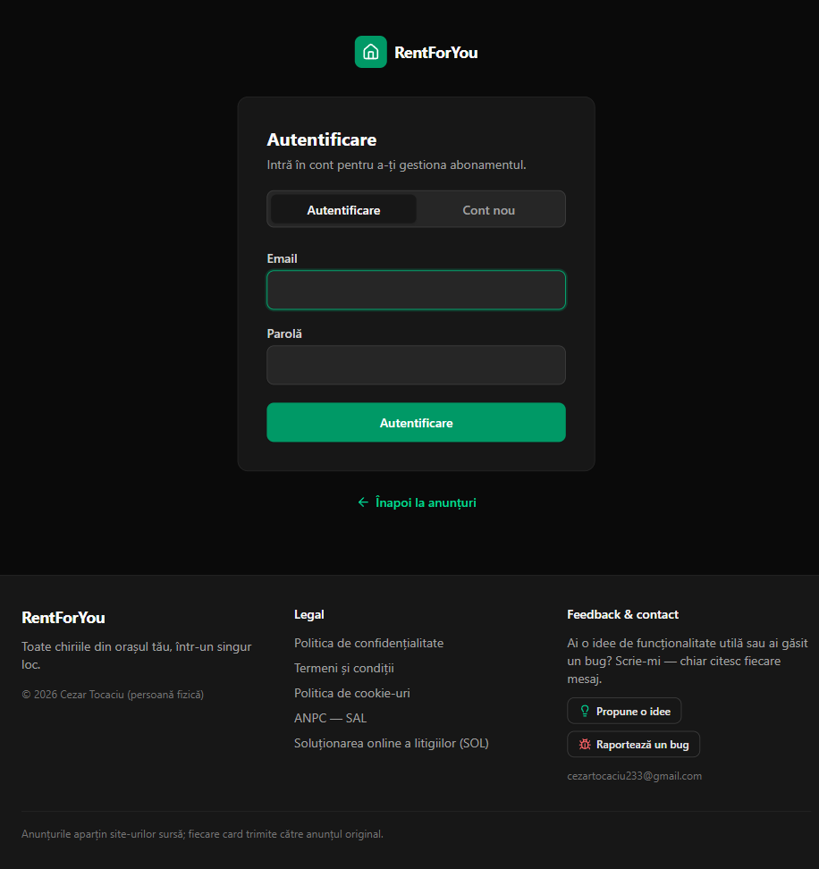
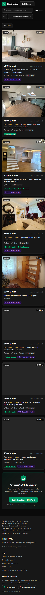

# Kira

**A rental-listings aggregator for Romania** — one search across many real-estate
sites, with filters the source sites don't offer: own-boiler vs district heating,
parking taxonomy, and automatic matching of apartments with nearby *rentable*
parking spots (walking distance included).

> Product name: **Kira** (kiraimobiliare.ro). Repository: `RentForYou`.

Built end to end: a polite scraping worker, a Romanian-language extraction
pipeline, a FastAPI backend with accounts + Stripe subscriptions, and a React SPA.

<p align="center">
  
  
</p>

> Cities: Cluj-Napoca, Oradea, Timișoara, Iași, Târgu Mureș, București
> (+ optional neighbouring towns, e.g. Florești/Baciu for Cluj). UI in Romanian.

---

## Why it exists

Romanian rental portals each cover a slice of the market and none let you filter on
what actually matters to a renter: *does the flat have its own gas boiler or is it on
city district heating?* *Is parking included, or is there a rentable spot nearby?*
Kira scrapes the listings, **extracts those facts from free Romanian text**,
geocodes them, and lets you filter — then sends every click back to the original ad.

## Highlights

- **6 source adapters** (Storia, OLX, Imobiliare, Publi24, Lajumate, Capital) behind a
  single `SiteScraper` contract — JSON-embedded (`__NEXT_DATA__`, `__PRERENDERED_STATE__`)
  and HTML adapters, all polite (per-host delay, page caps, budgeted detail fetches,
  never retry non-2xx).
- **Pure-regex Romanian extractors** on diacritics-folded text: parking taxonomy
  (included / likely / area-possible / none), heating (own boiler vs district),
  price with separator disambiguation, rooms, surface, street.
- **Parking ↔ rent matching**: scrapes standalone parking/garage ads separately,
  geocodes both (Nominatim, budget-capped, DB-cached), pairs them by haversine
  distance, estimates walking time, deep-links Google Maps, and flags
  *approximate* when an ad only gives a zone/landmark.
- **Freemium product**: anonymous users see the first *N* listings but always the
  real total; full access is a 15 RON/month Stripe subscription, cancellable in one
  click via the Billing Portal.
- **Accounts**: email+password (bcrypt) and Google Sign-In, JWT in an httpOnly
  cookie; GDPR account deletion that cancels live Stripe subs first.
- **Security-minded**: server-side paywall gating (never trust the client),
  per-IP rate limiting on every endpoint, an image proxy with a host whitelist +
  size cap + SSRF-safe redirect re-check, idempotent checkout, security headers,
  login-timing equalization.

## Architecture

```
                 ┌─────────────────┐
  source sites → │ scraping worker │ → extract → geocode → upsert ─┐
                 │  (APScheduler)  │   (regex)   (Nominatim+cache)  │
                 └─────────────────┘                               ▼
                                                            ┌──────────────┐
   React SPA  ◀──── JSON ────  FastAPI  ◀──── SQLAlchemy ── │  SQLite/PG   │
  (Vite+TS+TW)                (REST API)                     │   (WAL)      │
                                                            └──────────────┘
```

```
backend/   Python 3.12 · FastAPI · SQLAlchemy 2.0 (typed) · APScheduler · pytest
  app/scraping/sites/        one adapter per source (contract: base.py)
  app/scraping/extractors/   regex RO: parking, heating, price, rooms, street
  app/scraping/pipeline.py   RawListing → extract → geocode → idempotent upsert
  app/services/              geo (Nominatim + DB cache), parking↔rent matching
  app/api/routes/            listings, parking, meta, img, auth, billing, admin
  app/worker/                periodic per-city scrape (staggered), keeps data fresh
  app/data/cities/*.json     zones, nearby towns, per-site slugs (geo-verified)
frontend/  Vite · React 18 · TypeScript (strict) · Tailwind v4 · TanStack Query · Router
  filter state lives entirely in URL searchParams · class-based dark mode
```

**Stack:** Python 3.12, FastAPI, SQLAlchemy 2.0, APScheduler, Stripe, PyJWT, bcrypt ·
React 18 + TypeScript (strict), Tailwind v4, TanStack Query, React Router ·
SQLite (WAL) by default, Postgres-ready · Caddy + systemd on a single Hetzner VPS.

## Engineering notes worth a look

| Concern | Where | What's interesting |
|---|---|---|
| Heating semantics | `extractors/heating.py` | strips ambiguous phrases first, then classifies own-boiler vs district — RO text is messy |
| Price parsing | `extractors/price.py` | disambiguates `1.500` (thousands) vs `906.29` (decimal) vs `1,000` (EN); anchored regex ignores badge counters glued onto card prices |
| Idempotent ingest | `scraping/pipeline.py` | upsert by URL; re-runs on every scrape and after detail enrichment without duplicating |
| Geocoding ladder | `services/geo.py` | exact → street → zone → city, budget-capped, DB-cached; precision drives the "approximate distance" flag |
| Paywall integrity | `api/routes/listings.py` | gating is server-side only; `total` is always the real count (product rule) |
| Billing safety | `api/routes/billing.py` | idempotency key + server-side duplicate-subscription check; webhook signature verified, sync fallback for local dev |
| Abuse protection | `core/ratelimit.py`, `routes/images.py` | sliding-window per-IP limits; image proxy can't be turned into an open/SSRF proxy |

Quality gates: **75 backend tests** (pytest), `ruff` clean, frontend `tsc --strict`
+ ESLint clean. A live end-to-end smoke (`backend/tools/e2e_smoke.py`) drives 46
checks through the real proxy path; a load test (`tools/load_test.py`) measured
~165 req/s with p95 < 0.8 s at 100 concurrent requests on a single process.

## Screenshots

| Filters (own-boiler) | Dedicated auth page | Mobile |
|---|---|---|
|  |  |  |

## Quickstart

```bash
# backend
cd backend
python -m venv .venv
.venv/bin/pip install -e ".[dev]"          # Windows: .venv\Scripts\python.exe -m pip ...
.venv/bin/python -m pytest -q              # 75 tests
.venv/bin/python -m app.worker.scheduler --once --city cluj-napoca --max-pages 3
.venv/bin/python -m uvicorn app.main:app --reload --port 8000

# frontend (another terminal)
cd frontend
npm install
npm run dev        # http://localhost:5173 (proxies /api → :8000)
```

Config: copy `.env.example` → `.env` (all vars prefixed `RS_`, sane defaults).
Stripe/Google are optional locally — the app degrades gracefully without them.

## Deployment

Single Hetzner VPS (~4 €/mo): Caddy (automatic HTTPS, serves the static SPA +
reverse-proxies `/api`) + uvicorn + the scraping worker as systemd services, SQLite
in WAL. Full beginner-friendly guide: [`docs/DEPLOY_STEP_BY_STEP.md`](docs/DEPLOY_STEP_BY_STEP.md).

## Legal

Personal/educational project. Scraping is polite (delays, page caps, on-disk cache);
data stays at the source — the site only indexes and links back to the original ad.
Privacy, Terms and Cookie policies are served in-app (`/confidentialitate`,
`/termeni`, `/cookies`); GDPR erasure is one click in the account menu.

## License

[MIT](LICENSE) — free to use/modify with attribution, provided "as is".
This is a personal/educational project; if you run the scrapers, you are
responsible for complying with each source site's Terms of Service.

---

<sub>Author: Cezar Tocaciu · [LinkedIn](https://www.linkedin.com/in/tocaciu-cezar-0865373b6/) · built with a Romanian rental market in mind.</sub>
